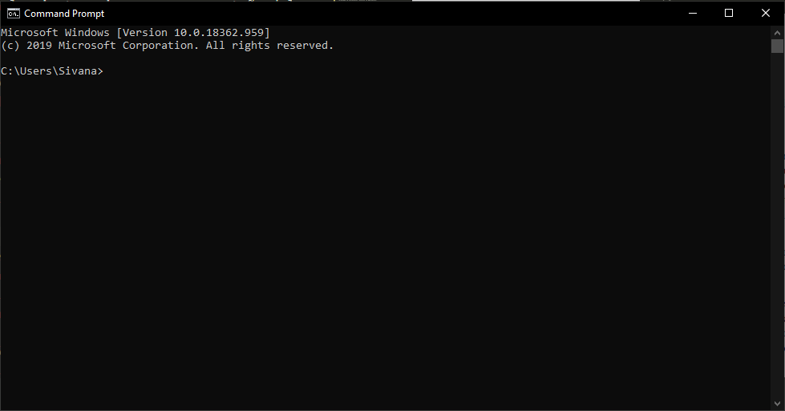
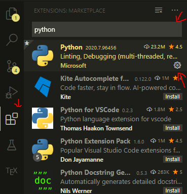
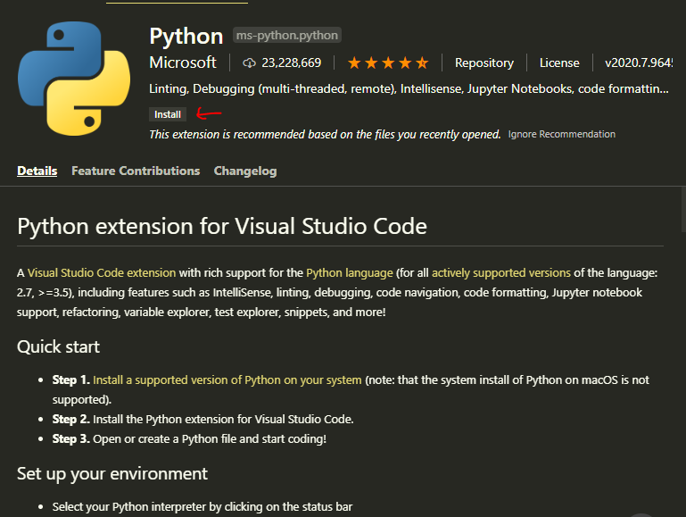

# Configuración del ambiente

Antes de que se pueda iniciar a programar, ocupamos configurar el ambiente de programación en nuestra computadora. A continuación se describen diversos pasos que se requieren realizar, en orden, para configurar el ambiente.

## Python

Python es un lenguaje de programación de alto nivel. Se puede descargar desde [este enlace](https://www.python.org/). Asegúrese de instalar la versión 3.10. Existen dos maneras de utilizar Python, dentro de modo inmediato y script. Nosotros vamos a utilizar Python en modo script.

Abra el intérprete de comandos de Windows. El intérprete o consola de Windows es un programa que permite llamar a otros programas por su nombre. Es una herramienta, también llamada terminal, útil para manejar programas y para programar. Para encontrarlo, se busca en el menú de inicio *Todos los Programas* > *Accesorios* >
*Símbolo del sistema*. También es posible encontrarlo mediante el buscador si se escribe cmd. Una vez encontrado y ejecutado, debería aparecer una pantalla negra con texto.



Revise que se haya instalado correctamente Python con el siguiente comando.

```bash
python3 -V
```

> ❗ Si no le funciona el comando anterior, intente ejecutar `python -V` o `py -V`.

## Visual Studio Code

Visual Studio Code es un IDE (*Integrated Development Environment*) que nos permite construir aplicaciones de software desde una interfaz gráfica. Los IDEs funcionan como editores de código fuente, constructores de código local automatizado, y depuradores de código. Se puede descargar desde [este enlace](https://code.visualstudio.com/).

Además, requerimos instalar el plug-in (un complemento de software adicional) de Python. Para instalar este desde la aplicación de Visual Studio Code se va a extensiones que se encuentra en la barra de navegación de la izquierda. Dentro de extensiones se busca “Python” y se selecciona el plug-in de Microsoft.



Luego, damos clic en instalar (flecha roja).



Terminada la instalación reinicie la aplicación.
