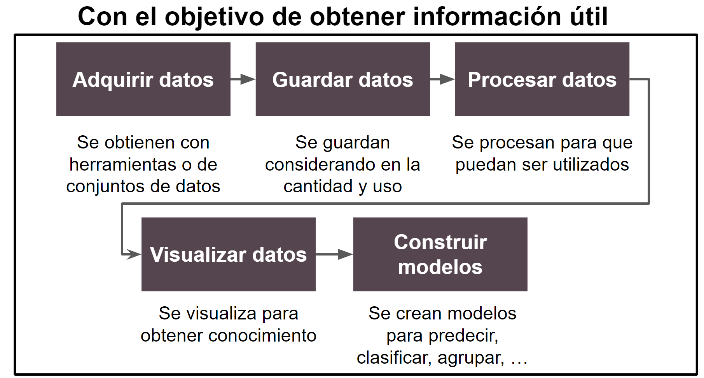

# Análisis de datos con Python

Dentro de este curso, se aprenderá a conocer y utilizar distintas librerías básicas de análisis de datos en Python.

## Proceso de análisis de datos

El siguiente es el proceso de análisis de datos que vamos a ver.

Específicamente, vamos a concentrarnos en los pasos de procesamiento de los datos, visualización de los datos y la construcción de modelos. Los enlaces a cada una de las fases se describen a continuación.

| Etapa         | Detalle                                                                                                              | Referencia                              |
|---------------|----------------------------------------------------------------------------------------------------------------------|-----------------------------------------|
| Configuración | Para poder iniciar el proceso, debemos configurar nuestro ambiente para que sea de uso.                              | [Enlace](./1-setup/README)              |
| Procesamiento | Se procesan los datos para que puedan ser utilizados en etapas posteriores.                                          | [Enlace](./2-data_processing/README)    |
| Visualización | Se visualiza la información para obtener conocimiento para el negocio y construir modelos.                           | [Enlace](./3-data_visualization/README) |
| Modelado      | Se construyen distintos tipos de modelos que sirven para predecir, clasificar, agrupar, entre otras funcionalidades. | [Enlace](./4-data_modeling/README)      |

## Material general

A continuación puede encontrar referencias al material general del curso.

| Material         | Enlace            |
|------------------|-------------------|
| Presentación     | [Enlace](./material/general.pdf) |

## Referencias adicionales

- [Ciencias de datos para principiantes](https://github.com/microsoft/Data-Science-For-Beginners)
- [Aprendizaje mecánico para principiantes](https://github.com/microsoft/ML-For-Beginners)
- [Inteligencia artificial para principiantes](https://github.com/microsoft/ai-for-beginners)
- [Inteligencia artificial para principiantes](https://github.com/microsoft/ai-for-beginners)
- [Una introducción al aprendizaje estadístico](https://www.statlearning.com/)
- [Repensando estadística](https://github.com/rmcelreath/stat_rethinking_2022)
